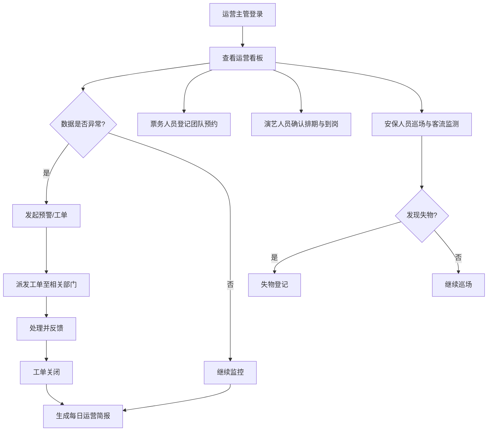

## 1. 产品概述

开封万岁山景区运营工作台是一款面向景区运营、票务、演艺和安保人员的日常协同管理平台，旨在将景区运营数据可视化、票务流程标准化、演出排期数字化、客流动态实时化，提升景区整体运营效率和游客体验。

- 解决多部门信息孤岛问题，实现运营数据一站式查看与协同
- 面向景区内部工作人员，提供从入园到闭园的全流程数字化管理

## 2. 核心功能

### 2.1 用户角色

| 角色 | 注册方式 | 核心权限 |
|------|----------|----------|
| 运营主管 | 管理员分配 | 查看全盘数据、发布通知、生成运营简报 |
| 票务人员 | 管理员分配 | 售票统计、团队预约登记、票务数据查看 |
| 演艺人员 | 管理员分配 | 演出排期管理、演员到岗确认、停演标记 |
| 安保人员 | 管理员分配 | 客流监测、巡场记录、失物登记、投诉处理 |

### 2.2 功能模块

1. **运营看板**：入园人数总览、关键运营指标、每日运营简报生成
2. **票务管理**：分时段售票统计、团队预约登记、票务数据汇总
3. **演出排期**：演出场次编排、演员到岗确认、节目临时停演标记
4. **客流监测**：分时客流趋势、热门区域客流预警、实时在园人数
5. **商铺管理**：摊位营业状态记录、租金到期提醒、经营数据概览
6. **投诉工单**：游客投诉受理、工单派发、处理进度跟踪
7. **巡场记录**：巡场拍照留痕、巡场路线记录、失物登记
8. **通知发布**：广播通知编辑、活动公告发布、每日运营简报推送

### 2.3 页面详情

| 页面名称 | 模块名称 | 功能描述 |
|----------|----------|----------|
| 运营看板 | 入园人数卡片 | 显示当日入园总人数、较昨日对比、实时在园人数 |
| 运营看板 | 关键指标面板 | 售票收入、投诉数量、演出场次、商铺营业率等核心指标一览 |
| 运营看板 | 分时入园趋势图 | 以折线图展示当日分时段入园人数走势 |
| 运营看板 | 运营简报生成 | 一键生成当日运营简报，包含各项关键数据汇总 |
| 票务管理 | 分时段售票统计 | 按时段统计各票种销售数量和金额，支持日期筛选 |
| 票务管理 | 团队预约登记 | 登记团队信息（名称、人数、联系人、预约日期），管理预约列表 |
| 票务管理 | 票种管理 | 查看各票种（成人票、儿童票、老年票、团队票等）销售情况 |
| 演出排期 | 场次编排日历 | 以日历视图展示演出排期，支持新增/编辑场次 |
| 演出排期 | 演员到岗确认 | 列出当日演出安排，逐场确认演员到岗状态 |
| 演出排期 | 停演标记 | 对临时停演的节目进行标记，记录停演原因 |
| 客流监测 | 分时客流趋势 | 实时展示各时段入园/出园人数曲线 |
| 客流监测 | 区域客流热力图 | 展示景区各热门区域当前客流密度及预警等级 |
| 客流监测 | 预警通知 | 当某区域客流达到阈值时自动触发预警提示 |
| 商铺管理 | 摊位营业状态 | 列出所有摊位的营业/歇业状态，支持状态切换 |
| 商铺管理 | 租金到期提醒 | 显示即将到期和已逾期的摊位租金，支持提醒标记 |
| 商铺管理 | 经营数据概览 | 各摊位营业额排名、营业率统计 |
| 投诉工单 | 投诉受理表单 | 录入游客投诉内容、类型、联系方式等信息 |
| 投诉工单 | 工单派发 | 将投诉工单分配给对应部门/人员处理 |
| 投诉工单 | 进度跟踪 | 查看工单处理状态（待处理/处理中/已完成），支持状态流转 |
| 巡场记录 | 巡场拍照留痕 | 记录巡场时间、路线、上传现场照片 |
| 巡场记录 | 失物登记 | 登记拾得/丢失物品信息，支持匹配查找 |
| 通知发布 | 广播通知编辑 | 编辑景区广播内容，选择播报时段和区域 |
| 通知发布 | 活动公告发布 | 发布活动公告，支持置顶和定时发布 |
| 通知发布 | 通知列表管理 | 查看已发布通知列表，支持撤回和编辑 |

## 3. 核心流程

**每日运营流程**：运营主管登录系统查看运营看板，了解当日入园人数与关键指标；票务人员实时监控售票数据并登记团队预约；演艺人员确认演员到岗并编排演出场次；安保人员关注客流预警并执行巡场任务；发现问题时通过投诉工单派发处理；运营结束生成每日简报。

**投诉处理流程**：受理投诉 → 创建工单 → 派发至相关部门 → 处理中 → 处理完成 → 关闭工单

## 4. 用户界面设计

### 4.1 设计风格

- **主色调**：以宋代青绿山水色为灵感——翠青 (#2D8B75) 为主色，赭石 (#C47335) 为强调色，营造古韵与现代融合的景区运营氛围
- **背景色**：深色工作台风格，主背景 (#0F1419)，卡片背景 (#1A2332)，层次分明
- **辅助色**：金色 (#D4A853) 用于重要数据高亮，红色 (#E85D4A) 用于预警/紧急状态
- **按钮风格**：圆角微凸风格，主按钮使用翠青色填充，次按钮使用描边样式
- **字体**：标题使用 Noto Serif SC（宋体风格），正文使用 Noto Sans SC，数据使用 DIN Alternate
- **布局风格**：左侧固定导航栏 + 右侧内容区，卡片式布局，数据面板为主
- **图标风格**：线性图标（Lucide），搭配微动效

### 4.2 页面设计概览

| 页面名称 | 模块名称 | UI 元素 |
|----------|----------|----------|
| 运营看板 | 入园人数卡片 | 大字号数据展示、环比箭头、微动效计数器、翠青色渐变背景 |
| 运营看板 | 关键指标面板 | 4列指标卡片网格、图标+数值+趋势组合 |
| 运营看板 | 分时入园趋势图 | 折线图、翠青色线条、面积填充、时间轴筛选 |
| 运营看板 | 运营简报生成 | 底部固定操作栏、生成按钮、简报预览弹窗 |
| 票务管理 | 售票统计 | 柱状图+数据表格、日期选择器、票种筛选标签 |
| 票务管理 | 团队预约登记 | 弹窗表单、预约列表表格、状态标签 |
| 演出排期 | 场次日历 | 周视图日历、拖拽排期、场次色块 |
| 演出排期 | 到岗确认 | 卡片列表、勾选确认按钮、状态指示灯 |
| 客流监测 | 客流热力图 | 景区平面示意图、色温渐变标注区域客流密度 |
| 客流监测 | 预警通知 | 右上角浮动通知、红色脉冲动效、预警等级标签 |
| 商铺管理 | 营业状态 | 卡片网格、营业/歇业状态切换开关、到期倒计时 |
| 投诉工单 | 工单看板 | 三列看板（待处理/处理中/已完成）、拖拽流转 |
| 巡场记录 | 巡场时间线 | 垂直时间线、照片缩略图、路线标签 |
| 通知发布 | 通知编辑器 | 富文本编辑区域、区域选择器、定时发布设置 |

### 4.3 响应式设计

- 桌面优先设计，最小支持 1280px 宽度
- 侧边栏在平板以下可收起为图标模式
- 数据图表在窄屏下自适应缩放
- 表格在移动端切换为卡片列表视图

### 4.4 无3D场景需求
