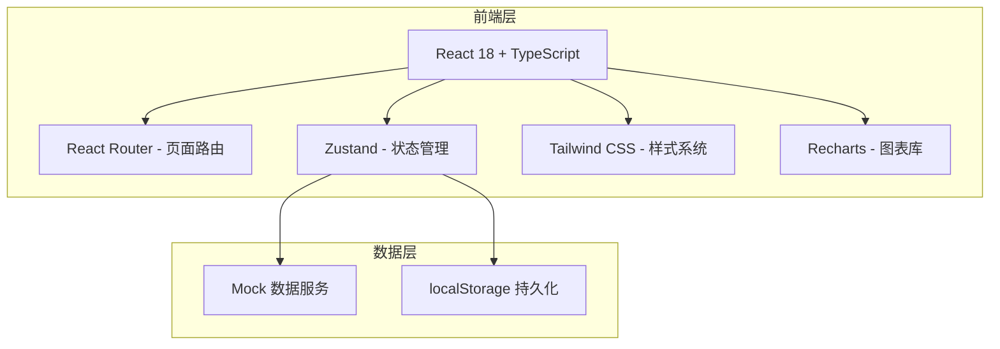
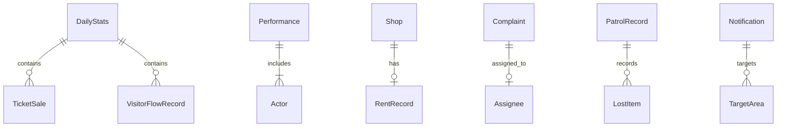

## 1. 架构设计



## 2. 技术说明

- **前端**：React@18 + TypeScript + Tailwind CSS@3 + Vite
- **初始化工具**：vite-init
- **后端**：无（纯前端项目，使用 Mock 数据）
- **数据库**：无（使用 localStorage + 内存数据模拟）
- **状态管理**：Zustand
- **路由**：React Router DOM v6
- **图表库**：Recharts
- **图标库**：Lucide React
- **日期处理**：date-fns

## 3. 路由定义

| 路由 | 用途 |
|------|------|
| / | 运营看板 - 默认首页，展示关键运营指标和入园数据 |
| /ticket | 票务管理 - 售票统计和团队预约管理 |
| /performance | 演出排期 - 场次编排和演员到岗管理 |
| /visitor-flow | 客流监测 - 实时客流和区域预警 |
| /shop | 商铺管理 - 摊位状态和租金管理 |
| /complaint | 投诉工单 - 投诉受理和工单跟踪 |
| /patrol | 巡场记录 - 巡场留痕和失物登记 |
| /notification | 通知发布 - 广播和公告管理 |

## 4. API 定义（无后端，Mock 数据）

### 4.1 数据模型

```typescript
interface DailyStats {
  date: string
  totalVisitors: number
  currentInPark: number
  ticketRevenue: number
  complaintCount: number
  performanceCount: number
  shopOpenRate: number
}

interface TicketSale {
  id: string
  timeSlot: string
  ticketType: string
  quantity: number
  amount: number
  date: string
}

interface TeamReservation {
  id: string
  teamName: string
  contactPerson: string
  contactPhone: string
  visitorCount: number
  reservationDate: string
  status: "pending" | "confirmed" | "cancelled"
  createdAt: string
}

interface Performance {
  id: string
  name: string
  venue: string
  startTime: string
  endTime: string
  date: string
  actors: Actor[]
  status: "scheduled" | "confirmed" | "cancelled"
  cancelReason?: string
}

interface Actor {
  id: string
  name: string
  role: string
  checkedIn: boolean
}

interface VisitorFlowRecord {
  timeSlot: string
  inCount: number
  outCount: number
  currentCount: number
}

interface AreaFlow {
  areaName: string
  currentCount: number
  capacity: number
  level: "normal" | "warning" | "danger"
}

interface Shop {
  id: string
  name: string
  location: string
  category: string
  isOpen: boolean
  rentExpiryDate: string
  monthlyRevenue: number
}

interface Complaint {
  id: string
  title: string
  content: string
  type: string
  reporterName: string
  reporterPhone: string
  status: "pending" | "processing" | "resolved"
  assignee?: string
  createdAt: string
  updatedAt: string
  remark?: string
}

interface PatrolRecord {
  id: string
  staffName: string
  route: string
  startTime: string
  endTime: string
  photos: string[]
  notes: string
  lostItems?: LostItem[]
}

interface LostItem {
  id: string
  name: string
  description: string
  location: string
  foundTime: string
  status: "registered" | "claimed" | "unclaimed"
  contactInfo?: string
}

interface Notification {
  id: string
  title: string
  content: string
  type: "broadcast" | "announcement" | "briefing"
  targetAreas: string[]
  status: "draft" | "published" | "revoked"
  publishTime?: string
  isPinned: boolean
  createdAt: string
}
```

## 5. 服务端架构（无后端）

本项目为纯前端应用，所有数据通过 Zustand Store 管理，初始数据在代码中定义，运行时修改保存在 localStorage。

## 6. 数据模型

### 6.1 数据模型关系图



### 6.2 数据初始化

项目启动时在 Zustand Store 中加载 Mock 数据，包含近7天的入园统计、当日各时段售票记录、预设演出排期、商铺信息、工单样本等，确保页面开箱即可展示完整功能。
